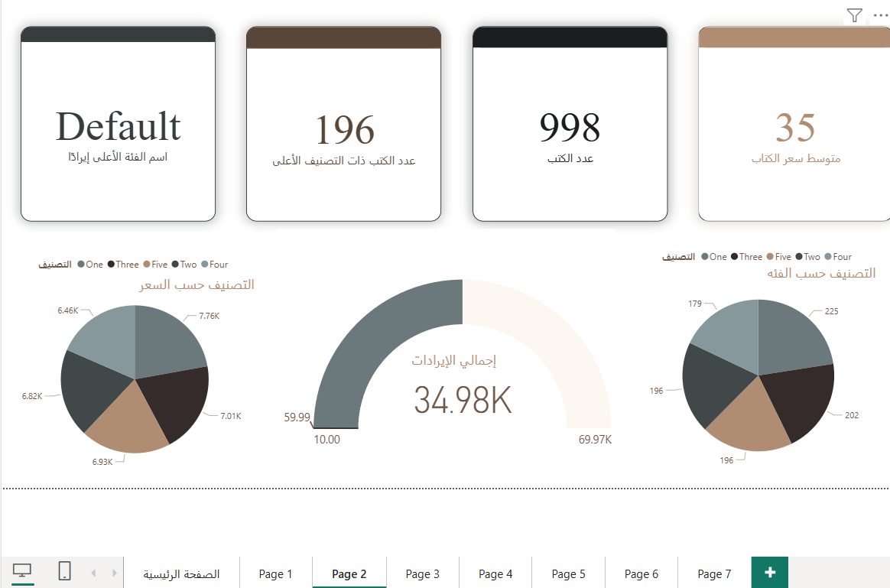

# تحليل اتجاهات الكتب الأكثر مبيعاً (Bestseller Analysis)

مشروع متكامل يجمع بين تحليل البيانات البرمجي باستخدام *Python* والعرض البصري التفاعلي باستخدام *Power BI*. يهدف المشروع إلى دراسة أنماط الكتب الأكثر مبيعاً واستخلاص رؤى حول تفضيلات القراء.

## الأدوات المستخدمة:
* *Python:* لاستخراج ومعالجة البيانات (Web Scraping & Analysis).
* *Power BI:* لتصميم لوحة تحكم تفاعلية تستعرض التقييمات وأكثر الكتب مبيعاً.
